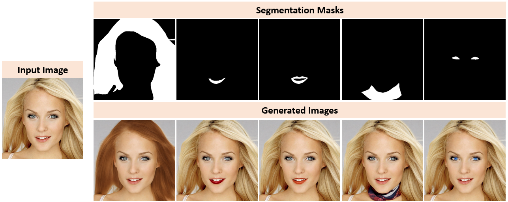
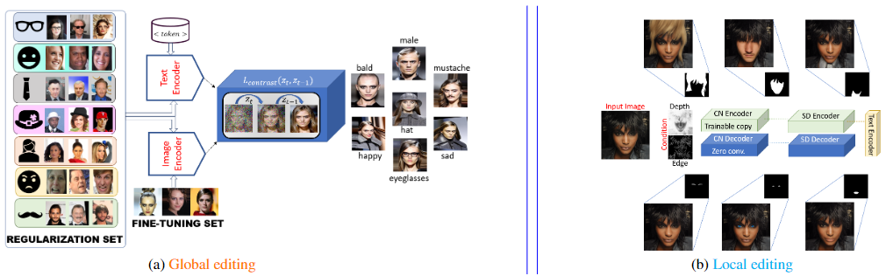

# MIAFR
This is the official implementation of **Mitigating the Impact of Attribute Editing on Face Recognition** that has been accepted in International Joint Conference in Biometrics (IJCB 2024). Refer to [our paper](https://arxiv.org/html/2403.08092v1).

Run `Demo.py` for a quick demo to obtain the outputs below. Running the script may require some time to load vae/diffusion-pytorch-model.safetensors and text_encoder/model.safetensors for the first time. You may enable the safety checker in the pipeline.



## Overview
Through a large-scale study over diverse face images, we show that facial attribute editing using modern generative AI models can severely degrade automated face recognition systems. This degradation persists even with generative models that include additional identity-based loss function. To mitigate this issue, we propose two novel techniques for local and global attribute editing. We empirically ablate twenty-six facial semantic, demographic and expression-based attributes that have been edited using state-of-the-art generative models, and evaluate them using ArcFace and AdaFace matchers on CelebA, CelebAMaskHQ and LFW datasets. Finally, we use LLaVA, an emerging visual question-answering framework for attribute prediction to validate our editing techniques. Our methods outperform the current state-of-the-art at facial editing (BLIP, InstantID) while retaining identity by a significant extent.



## Usage
- Global editing: Create the environment by following the steps outlined in [ID-Preserving-Facial-Aging](https://github.com/sudban3089/ID-Preserving-Facial-Aging). We fine-tune a pre-trained stable diffusion model whose weights can be downloaded from [Hugging Face](https://huggingface.co/CompVis) model card. We use `v1-5-pruned.ckpt` for regularization-based fine-tuning for global editing using the contrastive loss setting. Check `Scripts/AttributeEditing/Global` folder to look at the scripts. We have provided the main script(s) that may require hellper functions and auxillary scripts from [ID-Preserving-Facial-Aging](https://github.com/sudban3089/ID-Preserving-Facial-Aging) Global editing needs the data as follows:

We need a **Regularization Set** that comprises images depicting distinct individuals (disjoint from the training set) depicting varying attributes. We curated a set of 780 images that serves as image-caption pairs in this work. Download the Regularization Set used in our work from github or you can create your own regularization set but we cannot verify the performance with a custom regularization set. 

We need a **Training Set** that comprises images of a specific individual on whom the facial aging will be applied. The training set enables the diffusion model to learn the identity-specific charctristics during training that are then transferred at the time of generation of images for attribute editing. You need to collect the CelebA, LFW and CelebAMaskHQ datasets from the original sources.

- Local editing: Refer to `Scripts/AttributeEditing/Local` folder. There you will find two scripts: CN-IP.py (extension of Demo.py) and MaskFusion.py for fusing multiple masks for composite attribute editing. You need CelebAMaskHQ dataset for the images and the corresponding semantic segmentation masks.

- Baselines:
  - BLIPDiffusion: Refer to `Scripts/BLIPDiffusion/blip.py` for running BLIP Diffusion based local editing. Note that BLIP requires reference image for style transfer. For example, you need to change the hair color of the `source` image to black, then you need to provide a `target reference` image as someone with black hair. BLIP Diffuison can be used without ControlNet or with ControlNet. Check the script. Currenlty ControlNet is uncommented. Refer to [BLIP Diffusion](https://github.com/salesforce/LAVIS/tree/main/projects/blip-diffusion) for more details.
  - InstantID: Refer to `Scripts/InstantID` folder. Please follow the instructions of the original repo of [InstantID](https://github.com/InstantID/InstantID) and follow all the installation instructions. We only provided the main script(s) such as `infer_gender.py`, `infer_person.py`, `infer_wearing.py` and `infer_with.py`. The differences are only in the list of *attributes* and *n_prompt*. Make sure to load the checkpoints from the original repo.
  - MaskFaceGAN: We perform qualitative comparison with MaskFaceGAN. Please follow the instructions of the original repo of [MaskFaceGAN](https://github.com/MartinPernus/MaskFaceGAN) for pre-trained models and environment setup. Refer to `Scripts/MaskFaceGAN/main.py`.


## Evaluation

- Biometric matching: We perform biometric matching (with ArcFace) using [deepface](https://github.com/serengil/deepface) library and [AdaFace](https://github.com/mk-minchul/AdaFace) Refer to `Scripts/BiometricMatching`. For ArcFace use `ArcFace.py`. For AdaFace, follow the installation and usage instructions from the original repo and use `AdaFace.py` (we provided for a single attribute). Note AdaFace provides similarity scores whereas ArcFace povides distance scores in our implementation. If the scores belong to the same individual, then they are *genuine* else *imposter* scores. 
- Attribute prediction: We use LLaVa and BLIP_VQA for attribute prediction. Refer to `Scripts/AttributePredictionUsingLLaVa` and `Scripts/BLIP_VQA` for more details.

## Auxillary 

- Textual Inversion: Refer to `Scripts/Textual_Inversion`. Run `run_texinvSDV1_5.sh` that launches textual_inversion_train.py to learn a specific concept which can be either *--learnable_property="object"* or *--learnable_property="style"*, a special token *--placeholder_token="<specialtoken-person>"* and a specific class/domain *--initializer_token="person"*. The argument *--train_data_dir=$DATA_DIR* points to the images of the entity whose features will be captured by the placeholder token (in our case these are example images of a single individual). You can change *--num_vectors 5* (large number takes longer time). After the concept is learnt and saved, use textual_inversion_test.py where you load it using the command `pipeline.load_textual_inversion()` and provide the prompt as `"a high-resolution, detailed photo of <specialtoken-person> with long beard"`.
- DB-base: Refer to `Scripts/DB-Base` for running baseline experiments.
- t-SNE: Refer to `Scripts/t-SNE` for running some t-SNE based analysis on how different attribute edited facil embeddings differ form original embeddings. This evaluation was included in Supplementary Material in our paper.

## Citation
If you find this code useful or utilize it in your work, please cite:
```
@INPROCEEDINGS {MIAFR_IJCB2024,
author = {Sudipta Banerjee and Sai Pranaswi Mullangi and Shruti Wagle and Chinmay Hegde and Nasir Memon},
booktitle = {IEEE International Joint Conference on Biometrics (IJCB)},
title = {Mitigating the Impact of Attribute Editing on Face Recognition},
year = {2024},
}
```

## Acknowledgment and References
This repository is heavily dependent on code borrowed from different sources. 
 We use the official implementation of [ID-Preserving-Facial-Aging](https://github.com/sudban3089/ID-Preserving-Facial-Aging) for DB-prop. We use HuggingFace for implementing [textual inversion](https://huggingface.co/docs/diffusers/en/using-diffusers/textual_inversion_inference). We use the ControlNetV1.1 with Stable Diffusion V1.5 in [inpainting mode](https://huggingface.co/lllyasviel/control_v11p_sd15_inpaint). We use the ArcFace matcher from the [deepface library](https://github.com/serengil/deepface) and the [AdaFace matcher](https://github.com/mk-minchul/AdaFace) from its original implementation. We use the [BLIP Diffusion](https://github.com/salesforce/LAVIS/tree/main/projects/blip-diffusion) from the LAVIS library. We use [LLaVA](https://huggingface.co/docs/transformers/main/en/model_doc/llava) and [BLIP-VQA](https://huggingface.co/Salesforce/blip-vqa-base) from the HuggingFace.


